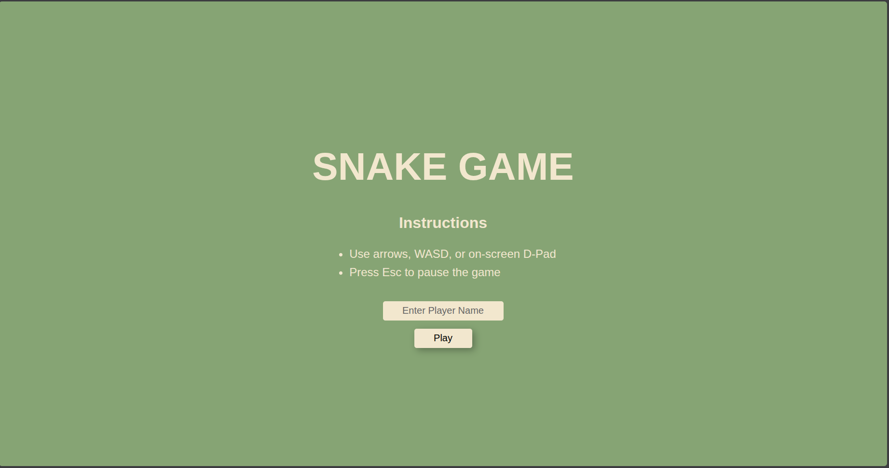
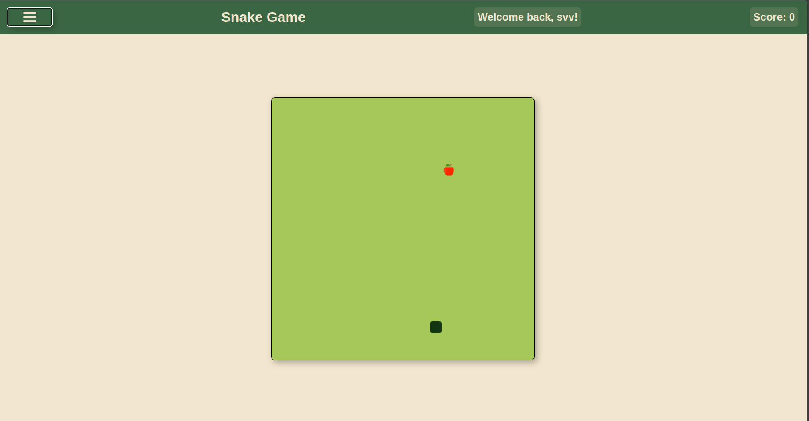
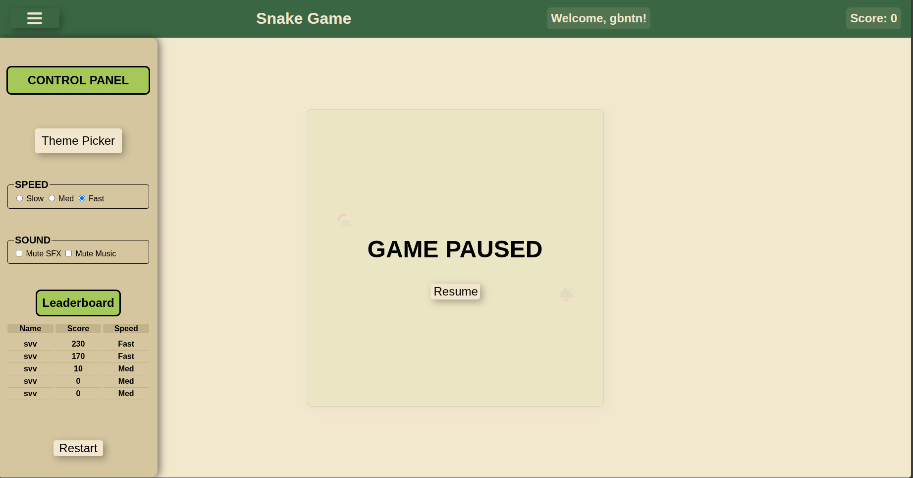
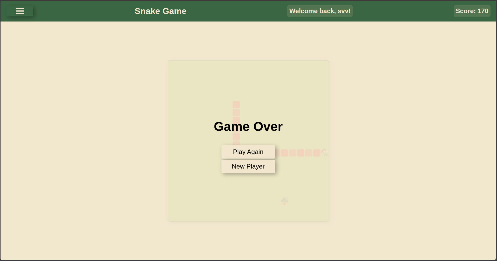
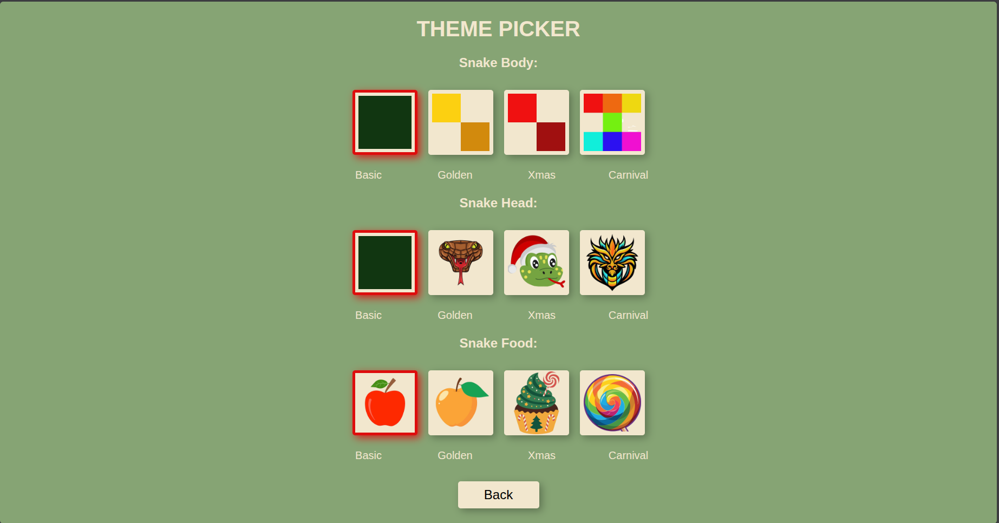
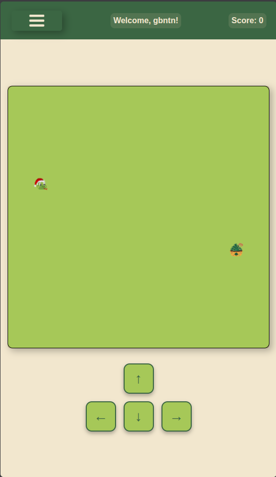

# Not Ur Regular Snake Game 🐍

A feature-rich, web-based classic Snake game built with HTML5 Canvas, CSS, and JavaScript. It includes customizable themes, local storage leaderboards, and audio support.

[PLAY NOW](https://ctarek2015-wq.github.io/snake-game/)

#

#

#

#

#

#

#

### **Features**

- **Classic Gameplay**: Move with W, A, S, D or Arrow keys. Eat food to grow and increase your score. Avoid the walls and your own tail!

- **Customizable Themes**: Mix and match themes for the Snake Head, Body, and Food. Includes Basic, Golden, Xmas, and Carnival themes.

- **Audio SFX & Music**: Enjoy background music while you play, with satisfying sound effects for eating and game over states. Includes mute toggles.

- **Adjustable Speed**: Choose between Slow, Med, and Fast difficulties.

- **Local Leaderboard**: Saves your player name and top 5 high scores locally in your browser so you can compete against yourself.

- **Pause Functionality**: Press `Escape` or use the on-screen button to pause the game at any time.

### **How to Run**

Because this project uses a single-file architecture (all CSS and JS are bundled into one HTML file), running it is incredibly simple.

1. Download or clone the `index.html` file to your local machine.

2. Double-click `index.html` to open it in your preferred web browser (Chrome, Firefox, Safari, Edge, etc.).

3. No server or build process is required!

(Note: In the provided code, generic placeholder images and audio URLs are used. For the best experience, replace these URLs in the `<audio>` and `` tags, as well as the JS objects, with your own local assets).

### **Controls**

- **Movement**: `W`, `A`, `S`, `D` or `Arrow Up`, `Arrow Down`, `Arrow Left`, `Arrow Right`.

- **Pause**: `Escape` key.

- **Start/Restart**: Use the on-screen buttons.

### **Architecture**

- **HTML5 Canvas**: Used for rendering the game grid, snake, and food efficiently.

- **JavaScript**: Handles the game loop (`setInterval`), collision detection, state management, and DOM manipulation.

- **CSS**: Flexbox and Absolute positioning are used to create the layout, control panels, and overlay menus.

### **Customizing Assets**

If you wish to use your own images or audio files, simply update the `src` attributes in the code:

1. **Audio**: Find the `<audio>` tags at the top of the `<body>` in `index.html` and change the `src` attribute within the `<source>` tags to your `.mp3` or `.wav` files.

2. **Images**: Search for the `headColor`, `foodColor`, and the Theme Picker HTML section in the file, and replace the placeholder URLs (e.g., https://placehold.co/...) with paths to your local image assets (e.g., ./assets/my-head.png).

### **Future Enhancements**

> 🎵 Dynamic Audio System

**Theme-Linked BGM:** Unique background music tracks that automatically switch to match your selected visual theme (e.g., 8-bit for Classic, upbeat for Carnival).

**Custom SFX:** Distinct, high-quality sound effects for eating food, hitting walls, and UI interactions.

**Adaptive Tempo:** Music speed dynamically scales with the selected game speed (Slow, Med, Fast).

**Advanced Controls:** Independent toggles to mute SFX and Music, plus volume sliders for precise mixing.

> 🍎 Special "Power-Up" Foods

**Golden Apple**: Appears rarely, disappears after 5 seconds. Gives +50 points and slightly reduces the snake's length to keep you alive longer.

**Poison Apple**: Looks slightly different. Eating it deducts points or temporarily reverses your controls!

> 🧱 Dynamic Obstacles & Mazes

Instead of an empty grid, we can add random brick walls that spawn when the game starts. As your score increases, more walls appear, turning the game into a maze.

> 🌀 Portal Walls (Wrap-around)

Instead of dying when you hit the edge of the screen, the snake teleports through the wall and comes out the opposite side! (This completely changes the strategy of the game).

> 🏆 Level-Up System

Instead of manually choosing the speed, the game automatically speeds up and the grid color shifts slightly every time you eat 5 apples, getting progressively harder.

> 👯 Local Multiplayer (2 Players)

Add a second snake! Player 1 uses W, A, S, D and Player 2 uses the Arrow Keys. First to crash into a wall or the other snake loses.
