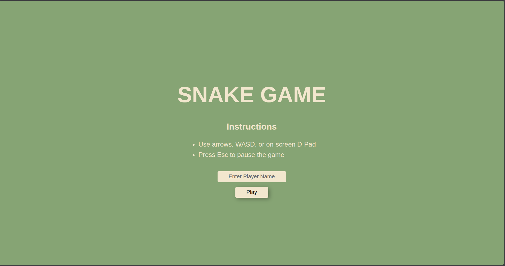
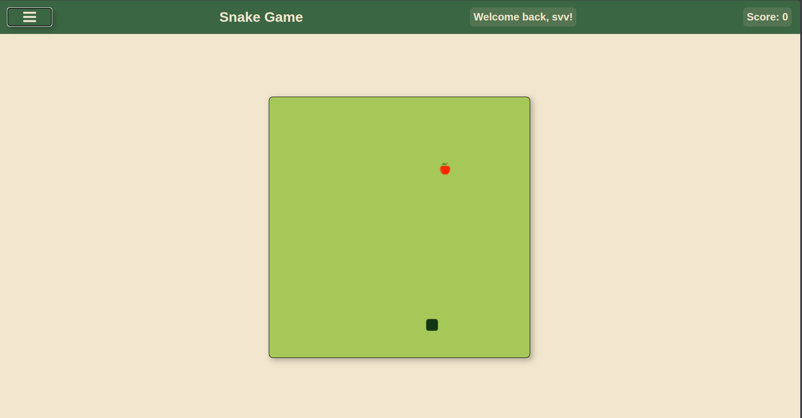

# Not Ur Regular Snake Game


A browser game built with HTML, CSS and JavaScript, using HTML5 Canvas for rendering and localStorage for player names and a top-five leaderboard.

Built by [Ahmed Tarek](https://github.com/ctarek2015-wq).

[Play on GitHub Pages](https://ctarek2015-wq.github.io/snake-game/)

## Implemented Features

- Classic snake movement, food spawning, growth, scoring, and wall/self collision detection on a 20-by-20 grid.
- Keyboard movement with WASD or arrow keys and an on-screen directional pad for touch input.
- Slow, Medium and Fast speeds (450, 300 and 150 milliseconds per game tick).
- Independently selectable head, body and food themes: Basic, Golden, Xmas and Carnival.
- Pause/resume with Escape or the menu toggle; resume and restart controls with game-state overlays.
- Persistent player names and a local top-five leaderboard with each result's speed.

## Run Locally

Clone or download the complete repository so the styles, script and images remain available:

```bash
git clone https://github.com/ctarek2015-wq/snake-game.git
cd snake-game
```

Open `index.html` in a modern browser. There is no package installation or build step. Alternatively, if Python is installed, serve the folder:

```bash
python -m http.server 8000
```

Then open `http://localhost:8000`. Leaderboard storage belongs to that browser and origin, so the hosted app and a local server keep separate scores.

## Controls

| Action | Control |
| --- | --- |
| Move / start moving | WASD, arrow keys, or the touch directional pad |
| Pause / resume | Escape or the menu toggle |
| Resume from pause | Resume button |
| Restart | Restart / Play Again button |
| Change player | New Player button after game over |

## Architecture

- `index.html`: page structure, canvas, theme picker, control panel and state overlays.
- `css/style.css`: responsive layout, controls, theme selection and overlays.
- `js/app.js`: interval-based game loop, direction changes, collision detection, canvas drawing, event handlers and localStorage persistence.
- `assets/pic/`: logo, theme images and screenshots.

Image paths are configured in `js/app.js` and the theme-picker markup in `index.html`. Keep the referenced assets when copying the project.

## Screenshots




## Current Limits and Future Work

The Sound controls are present in the interface, but audio playback and mute behavior are not implemented. The leaderboard is local to the browser, with no online accounts or shared ranking. There is no committed automated test suite.

Possible extensions include working music/SFX controls, power-up foods, obstacles and additional game modes.
